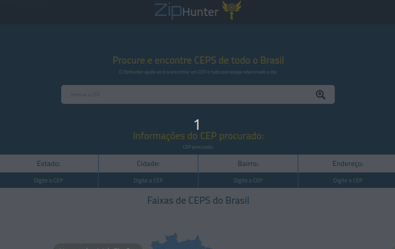

<p align="center">
  

  

  <a href="https://www.linkedin.com/in/rafael-martins-ribeiro/">
    
  </a>

  <a href="https://github.com/RafaelMartinsRibeiro/ZipHunter/commits/master">
    
  </a>

  

   <a href="https://github.com/RafaelMartinsRibeiro/ZipHunter/stargazers">
    
  </a>
</p>


<h1 align="center">
   
</h1>


<p align="center">
    <a href="#-tecnologias">Tecnologias</a>&nbsp;&nbsp;&nbsp;|&nbsp;&nbsp;&nbsp;
    <a href="#-projeto">Projeto</a>&nbsp;&nbsp;&nbsp;|&nbsp;&nbsp;&nbsp;
    <a href="#-features">Features</a>&nbsp;&nbsp;&nbsp;|&nbsp;&nbsp;&nbsp;
    <a href="#-como-contribuir">Como contribuir</a>&nbsp;&nbsp;&nbsp;|&nbsp;&nbsp;&nbsp;
    <a href="#memo-licença">Licença</a>
  </p>

<h1 align="center">
  
</h1>


## 🚀 Tecnologias

Esse projeto foi desenvolvido com as seguintes tecnologias:

- [Vite](https://vitejs.dev/)
- [React](https://reactjs.org)
- [TypeScript](https://www.typescriptlang.org)
- [Axios](https://axios-http.com/ptbr/docs/intro)
- [React Google Charts](https://www.react-google-charts.com/)
- [Sass](https://sass-lang.com/)
- [Context API](https://pt-br.reactjs.org/docs/context.html)


## 💻 Projeto
Você pode acessar o projeto através [desse link](https://zip-hunter.vercel.app/).

Este projeto consiste em uma aplicação web 100% responsiva que tem como princial objetivo realizar a busca de informações de determinada região do Brasil através do numero de CEP, no projeto contém também todas as faixas de CEPS dos estados do Brasil.


## 🌟 Features

-   [x] 100% Responsivo.
-   [x] Busca de CEPS.
-   [x] Mapa interativo.


## 🤔 Como contribuir

- Faça um fork desse repositório;
- Cria uma branch com a sua feature: `git checkout -b minha-feature`;
- Faça commit das suas alterações: `git commit -m 'feat: Minha nova feature'`;
- Faça push para a sua branch: `git push origin minha-feature`.


### 🧭 Rodando a aplicação

```bash
# Clone este repositório
$ git clone https://github.com/RafaelMartinsRibeiro/ZipHunter
# Acesse a pasta do projeto no seu terminal/cmd
$ cd ZipHunter
# Instale as dependências
$ npm install || yarn install
# Execute a aplicação em modo de desenvolvimento
$ npm run dev || yarn dev
# A aplicação será aberta na porta:3000 - acesse http://localhost:3000
```


## :memo: Licença

Esse projeto está sob a licença MIT. Veja o arquivo [LICENSE](LICENSE.md) para mais detalhes.

---

